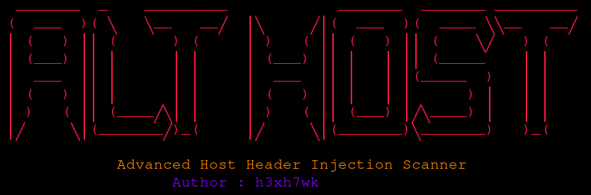

<p align="center">
  
</p>

Scans for Host Header Injection and related poisoning signals by comparing a baseline request against multiple header mutation modes, scoring the strongest signal per target. Supports domain enumeration, live probing, path spraying, evidence collection, and optional HTML reporting.

Features :

- Subdomain enumeration (`-d`) using `subfinder` / `assetfinder` / `amass` (auto-detected if installed)
- Live host probing using `httpx` or `httprobe` (auto-detected if installed)
- Single URL mode (`-u`) or list mode (`-l`) with automatic URL normalization
- Path spraying (`-p`) to test common auth/admin/API endpoints
- Multiple header mutation modes (`-H`), including a `combined` mode
- Detection signals: header/body reflection, redirect poisoning, absolute URL poisoning, CORS origin reflection, cache signals, and response diffs (status/title/length)
- Evidence collection per target/mode (headers/body previews) saved under `evidence/` and `raw/`
- Output formats: `results.txt`, `results.csv`, `results.jsonl`, and `potential_findings.txt`
- Parallel scanning (`-P`), resume mode (`-r`), proxy support (`-x`), GET/HEAD (`-m`), and redirect control (`-nr`)
- Optional local HTML report (`-A`) generated as `report.html`

Usage :

```bash
./althost.sh -u https://target.tld [options]
./althost.sh -d example.com [options]
./althost.sh -l urls.txt [options]
```

Example :

```bash
./althost.sh -u https://target.tld -x http://127.0.0.1:8080 -A
./althost.sh -d example.com -P 20 -a canary.yourcollab.test
./althost.sh -l urls.txt -p '/,/login,/forgot-password'
```
